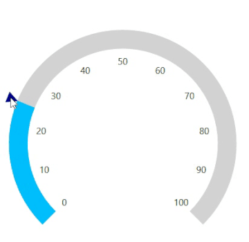
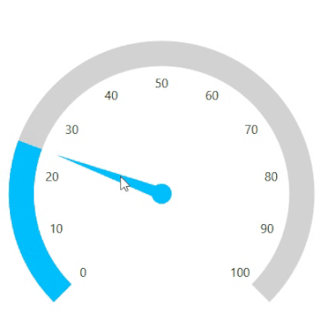

# How to drag the pointers (symbol & needle) in the WPF circular gauge (SfCircularGauge)

This article explains how to drag the both symbol and needle pointer in the Syncfusion WPF SfCircularGauge control. It has been achieved by setting EnableDragging property as true.

## How to drag the symbol pointer 

 

To obtain the same behavior, please follow the following code snippet

[XAML]

```
    <gauge:SfCircularGauge >
        <gauge:SfCircularGauge.Scales >
            <gauge:CircularScale LabelPosition="Custom"  Grid.Row="1" 
                                 RimStroke="LightGray" 
                                 RadiusFactor="1" ShowTicks="False"
                                 RimStrokeThickness="30"     
                                 StartValue="0" EndValue="100" Interval="10" 
                                 LabelOffset="0.75" LabelStroke="Black" FontSize="15">
                <gauge:CircularScale.Ranges>
                    <gauge:CircularRange StrokeThickness="30" StartValue="0" 
                                         x:Name="range" EndValue="25" 
                                         Stroke="DeepSkyBlue"/>
                </gauge:CircularScale.Ranges>
                <gauge:CircularScale.Pointers>
                    <gauge:CircularPointer PointerType="SymbolPointer" 
                                           Symbol="InvertedTriangle" 
                                           SymbolPointerHeight="18" SymbolPointerWidth="18"
                                           ValueChanged="CircularPointer_ValueChanged"  
                                           SymbolPointerStroke= “DeepSkyBlue" Value="25" 
                                           EnableAnimation="False" EnableDragging="True"/>
                </gauge:CircularScale.Pointers>
            </gauge:CircularScale>
        </gauge:SfCircularGauge.Scales>
    </gauge:SfCircularGauge>
```

## How to drag the needle pointer 

 

To construct the above UI along with its dragging animation, please refer the below code snippet

 [XAML]
 
 ```
    <gauge:SfCircularGauge >
        <gauge:SfCircularGauge.Scales >
            <gauge:CircularScale LabelPosition="Custom"  Grid.Row="1" 
                                 RimStroke="LightGray" 
                                 RadiusFactor="1" ShowTicks="False"
                                 RimStrokeThickness="30"     
                                 StartValue="0" EndValue="100" Interval="10" 
                                 LabelOffset="0.75" LabelStroke="Black" FontSize="15">
                <gauge:CircularScale.Ranges>
                    <gauge:CircularRange StrokeThickness="30" StartValue="0" 
                                         x:Name="range" EndValue="25" 
                                         Stroke="DeepSkyBlue"/>
                </gauge:CircularScale.Ranges>
                <gauge:CircularScale.Pointers>
                    <gauge:CircularPointer  PointerType="NeedlePointer" NeedlePointerType="Triangle" Value="25"
                           NeedlePointerStroke="DeepSkyBlue" PointerCapDiameter="25" KnobStroke="DeepSkyBlue" KnobFill="DeepSkyBlue"
                           NeedleLengthFactor="0.7" NeedlePointerStrokeThickness="15" ValueChanged="CircularPointer_ValueChanged" EnableDragging="True"/>
                </gauge:CircularScale.Pointers>
            </gauge:CircularScale>
        </gauge:SfCircularGauge.Scales>
    </gauge:SfCircularGauge>
```

[C#]

```
        private void CircularPointer_ValueChanged(object sender, ValueChangedEventArgs e)
        {
            range.EndValue = e.Value;
        }
```

KB article - [How to drag the pointers (symbol & needle) in the WPF circular gauge (SfCircularGauge)](https://www.syncfusion.com/kb/11908/how-to-drag-the-symbol-needle-pointers-in-the-wpf-circular-gauge-sfcirculargauge)

## See also

[How to customize the needle pointer in WPF SfCircularGauge](https://help.syncfusion.com/wpf/radial-gauge/pointers#needle-pointer)

[How to customize the range pointer in WPF SfCircularGauge](https://help.syncfusion.com/wpf/radial-gauge/pointers#range-pointer)

[How to customize the symbol pointer in WPF SfCircularGauge](https://help.syncfusion.com/wpf/radial-gauge/pointers#symbol-pointer)

[How to set the animation for pointer in WPF SfCircularGauge](https://help.syncfusion.com/wpf/radial-gauge/pointers#setting-animation-for-pointer)

[How to set the multiple pointers in WPF SfCircularGauge](https://help.syncfusion.com/wpf/radial-gauge/pointers#setting-multiple-pointers)


